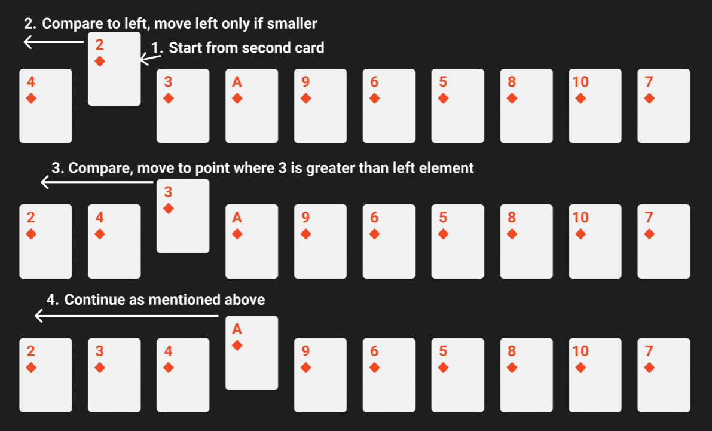
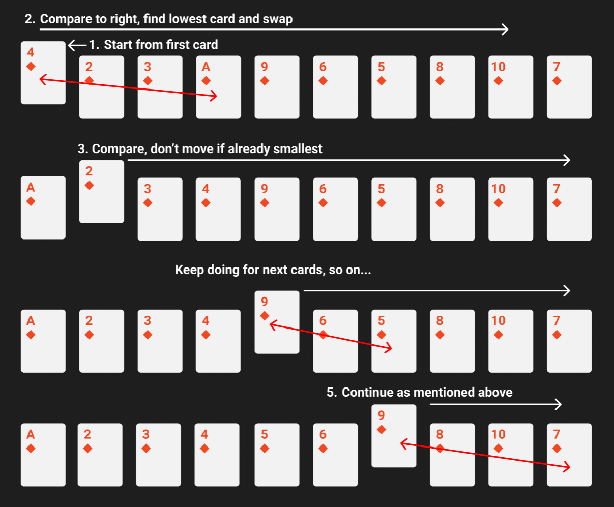

# Algorithms & Data Structures
~ From Introduction to Algorithms, CLRS, 3rd Ed.

## 1. Insertion Sort

```c#
int[] IncreasingSort(int[] Sequence)
{
    for (int j = 1; j < Sequence.Length; j++)
    {
        int key = Sequence[j];
        int i = j - 1;
        while (i >= 0 && Sequence[i] > key)
        {
            Sequence[i + 1] = Sequence[i];
            i--;
        }
        Sequence[i + 1] = key;
    }

    return Sequence;
}
```
Insertion Sort handles sorting in a very easy way, Scanning from left to right, one element at a time. It picks an element, checks it to its left side, if found smaller to the left element it shifts the left elements by one towards right and places picked element on left of them until there is no element on left side greater than it.

## 2. Linear Search
```c#
int? Search(int[] Sequence, int SearchValue)
{
    int? index = null;
    for (int i = 0; i < Sequence.Length; i++)
    {
        if (Sequence[i] == SearchValue)
        {
            index = i;
            break;
        }   
    }

    return index;
}
```
Linear Search is just returning the index of an element if it is found among the array of elements, if not found Null is returned.

## 3. N-Bit Addition
```c#
int[] A = new int[8];
int[] B = new int[8];
int[] C = new int[9];

public int[] Sum()
{
    int carry = 0;
    for (int i = A.Length - 1; i >= 0; i--)
    {
        C[i + 1] = (A[i] + B[i] + carry) % 2;
        if ((A[i] + B[i] + carry) >= 2)
            carry = 1;
        else
            carry = 0;
    }

    C[0] = carry;

    return C;
}
```
Two N-bit arrays are added and results are stored in N+1 bit array where left most digit shows the carry.

## 4. Selection Sort

```c#
int[] Sort(int[] Sequence)
{
    for (int i = 0; i < Sequence.Length - 1; i++)
    {
        int min = i;
                
        for (int j = i + 1; j < Sequence.Length; j++)
        {
            if (Sequence[j] < Sequence[min])
            {
                min = j;
            }
        }

        (Sequence[min], Sequence[i]) = (Sequence[i], Sequence[min]);
    }

    return Sequence;
}
```
Selection Sort is like Insertion Sort but in this, an element is picked from the pile starting from left side, and compared against the right sided elements to find any other element smallest than it, if found the element is swapped with it.

Note: Whenever we use swap like in Selection Sort or Bubble Sort, anything involving swapping, point to remember is we don't need to run loop till the last value, since with whom we want to swap the last element, it is already swapped at some point earlier, hence save yourself a loop condition and make sure to run the loop just about the Length - 1.

## 5. Bubble Sort

```c#
int[] Sort(int[] sequence)
{
    for (int i = 0; i < sequence.Length - 1; i++)
    {
        for (int j = sequence.Length - 1; j > i; j--)
        {
            if (sequence[j] < sequence[j - 1])
            {
                (sequence[j], sequence[j - 1]) = (sequence[j - 1], sequence[j]);
            }
        }
    }

    return sequence;
}
```

## 6. Merge Sort
Note: It is required to specify a condition for breaking recursion, to prevent endless trap. So in all recursion based algorithms like Merge Sort, Binary Search etc., specify a breaking condition or breakpoint for recursion at the starting.
```c#
void Merge(int[] A, int P, int Q, int R)
{
    int n1 = Q - P + 1;
    int n2 = R - Q;

    int[] left = new int[n1];
    int[] right = new int[n2];

    int i, j, k = P;
    for (i = 0; i < n1; i++) left[i] = A[P + i];
    for (j = 0; j < n2; j++) right[j] = A[Q + j + 1];

    i = j = 0;
            
    while (i < n1 && j < n2)
    {
        if (left[i] <= right[j]) 
            A[k++] = left[i++];
                
        else
            A[k++] = right[j++];
    }

    while (i < n1)
    {
        A[k++] = left[i++];
    }
    while (j < n2)
    {
        A[k++] = right[j++];
    }
}

public int[] Sort(int[] A, int P, int R)
{
    if (P < R) // Recursion break condition: P >= R
    {
        int Q = (P + R)/2;

        Sort(A, P, Q);
        Sort(A, Q + 1, R);

        Merge(A, P, Q, R);
    }

    return A;
}
```

## 7. Binary Search
```c#
int? Search(int[] A, int key, int P, int R) // This BinarySearch operates on sorted arrays only
{
    if (P > R) return null;
    else
    {
        int Q = (P + R) / 2;

        if (A[Q] == key)
            return Q;
        else if (A[Q] < key)
            return Search(A, key, Q + 1, R);
        else
            return Search(A, key, P, Q - 1);
    }
}
```

## 8. Max Sub-Array
```c#
(int left, int right, int sum) FindMidCrossingArray(int[] A, int P, int Q, int R)
{
    int lSum = int.MinValue, rSum = int.MinValue, sum = 0, left = P, right = R;
    for (int i = Q; i >= P; i--)
    {
        sum += A[i];
        if (sum > lSum)
        {
            lSum = sum;
            left = i;
        }
    }
    sum = 0;
    for (int i = Q + 1; i <= R; i++)
    {
        sum += A[i];
        if (sum > rSum)
        {
            rSum = sum;
            right = i;
        }
    }

    return (left, right, lSum + rSum);
}

(int left, int right, int sum) FindMaxSubArray(int[] A, int P, int R)
{
    if (P == R) return (P, R, A[P]);

    int Q = (P + R) / 2;
    (int leftLow, int leftHigh, int leftSum) = FindMaxSubArray(A, P, Q);
    (int rightLow, int rightHigh, int rightSum) = FindMaxSubArray(A, Q + 1, R);
    (int crossLow, int crossHigh, int crossSum) = FindMidCrossingArray(A, P, Q, R);

    if (leftSum >= rightSum && leftSum >= crossSum)
        return (leftLow, leftHigh, leftSum);
    else if (rightSum >= leftSum && rightSum >= crossSum)
        return (rightLow, rightHigh, rightSum);
    else 
        return (crossLow, crossHigh, crossSum);
}
```

## 9. Heap Sort
```c#
int Left(int i) => 2 * i + 1;
int Right(int i) => 2 * i + 2;
int _heapSize = 8;

void MaxHeapify(int[] a, int i)
{
    int l = Left(i);
    int r = Right(i);
    int largest;

    if (l < _heapSize && a[l] > a[i])
        largest = l;
    else
        largest = i;

    if (r < _heapSize && a[r] > a[largest])
        largest = r;

    if (largest != i)
    {
        (a[i], a[largest]) = (a[largest], a[i]);
        MaxHeapify(a, largest);
    }
}

void BuildMaxHeap(int[] a)
{
    for (int i = (_heapSize - 1) / 2; i >= 0; i--)
        MaxHeapify(a, i);
}

int[] Sort(int[] a)
{
    BuildMaxHeap(a);

    for (int i = (_heapSize - 1); i > 0; i--)
    {
        (a[0], a[i]) = (a[i], a[0]);
        _heapSize--;
        MaxHeapify(a, 0);
    }

    return a;
}
```

## 10. Quick Sort
```c#
int Partition(int[] a, int p, int r)
{
    int x = a[r];
    int i = p - 1;
    for (int j = p; j <= r - 1; j++)
    {
        if (a[j] <= x)
        {
            i++;
            (a[i], a[j]) = (a[j], a[i]);
        }
    }

    (a[i + 1], a[r]) = (a[r], a[i + 1]);
    return i + 1;
}

int[] Sort(int[] a, int p, int r)
{
    if (p < r)
    {
        int q = Partition(a, p, r);
        Sort(a, p, q - 1);
        Sort(a, q + 1, r);
    }
            
    return a;
}
```

## 11. Count Sort
```c#
int Max(int[] a)
{
    int max = 0;
    for (int i = 0; i < a.Length; i++)
    {
        if (a[i] > max)
            max = a[i];
    }

    return max;
}

int[] Sort(int[] a)
{
    int[] b = new int[a.Length];
    int[] c = new int[Max(a) + 1];

    for (int i = 0; i < a.Length; i++) // Count each element in a, store the count in c
        c[a[i]]++;

    for (int i = 1; i < c.Length; i++) // This provides position of elements in a, where to put in b
        c[i] += c[i - 1];

    for (int i = a.Length - 1; i >= 0; i--)
    {
        b[c[a[i]] - 1] = a[i];
        c[a[i]]--;
    }

    return b;
}
```